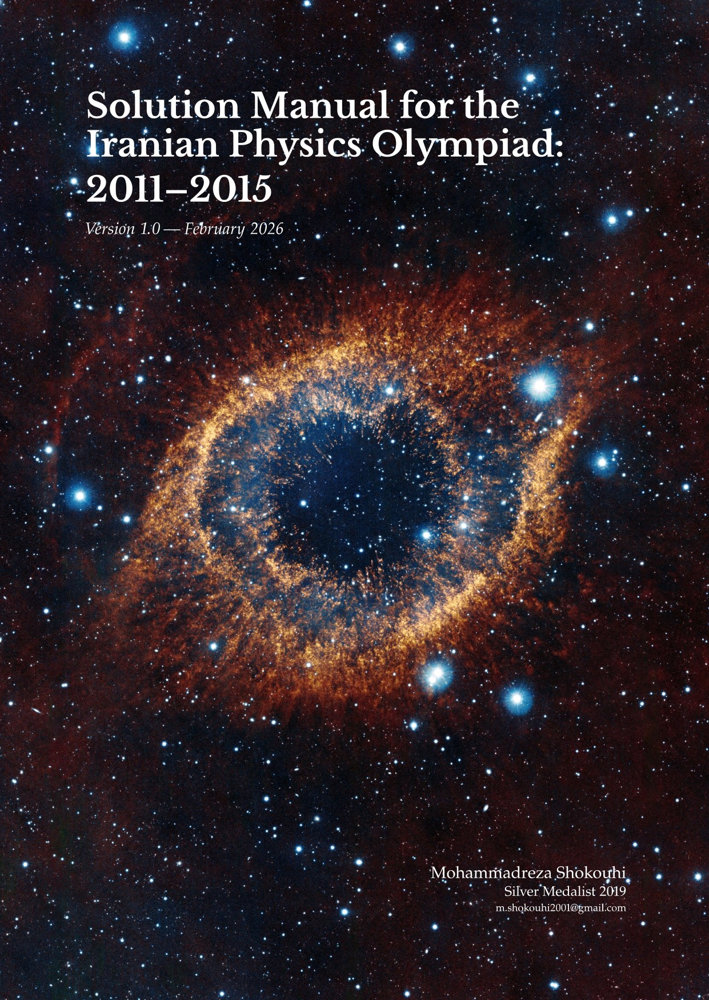

# Physics Olympiad Resources

This repository is a dedicated hub for high-level Physics Olympiad materials, with a primary focus on the **Iranian National Physics Olympiad**. 

Physics Olympiads serve as a cornerstone for developing deep physical intuition and rigorous computational mastery. The goal of this project is to provide clear, high-quality resources to help students navigate these challenging competitions.

---

## 📚 Featured Work: Solution Manual (2011–2015)

The primary resource currently available is the **Solution Manual for the Iranian Physics Olympiad: 2011–2015**. 

### **Key Features**
- **Comprehensive Solutions:** Detailed step-by-step derivations for all problems from the years 2011-2015.
- **Academic Standard:** Formatted in LaTeX to ensure clarity in mathematical notation and diagrams.
- **Pedagogical Approach:** Focuses on the "why" behind each step, not just the final answer.

### **Direct Download**
👉 **[Download the Latest PDF (Version 1.0)](https://github.com/MShokouhi/Physics-Olympiad/releases/download/v1.0/IranPhO_Solutions_2011-2015_v1.0.pdf)**

---

## 🛠 Project Status & Future Work
This is a living project. I intend to expand this repository with:
- [ ] Solutions for the 2016–2020 cycles.
- [ ] Specialized notes on Approximation and Perturbation methods.

---

## 🐛 Feedback and Errata
Accuracy is the highest priority for this manual. If you find any typos, errors in the physics, or unclear steps:
1. Open an **[Issue](https://github.com/MShokouhi/Physics-Olympiad.git/issues)** here on GitHub.
2. Or contact me via email at: `m.shokouhi2001@gmail.com`

---

## ⚖️ License
This work is licensed under a **Creative Commons Attribution-NonCommercial-NoDerivatives 4.0 International License (CC BY-NC-ND 4.0)**.
- You are free to share and distribute the PDF.
- You must give appropriate credit to the author.
- You may **not** use this work for commercial purposes.
- You may **not** distribute modified versions of the work.

---

**About the Author**  
*Mohammadreza Shokouhi is a Silver Medalist of the 2019 Iranian National Physics Olympiad.*
